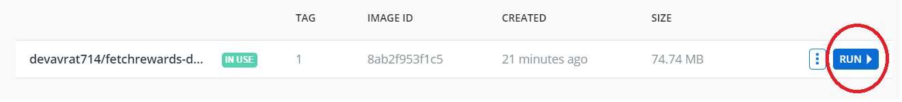
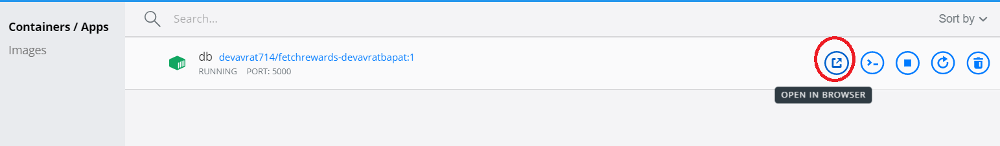
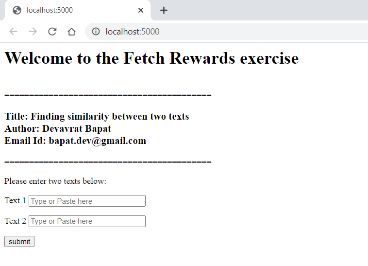
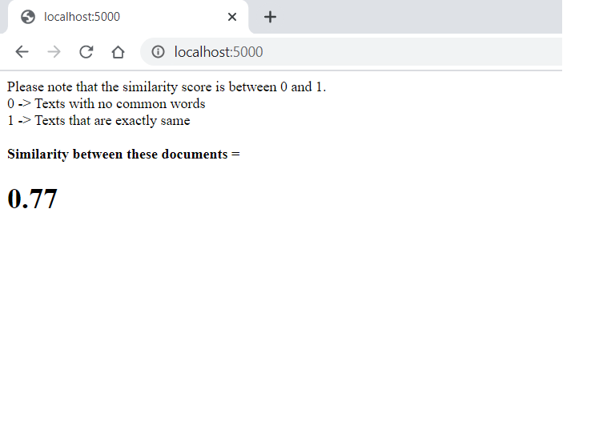
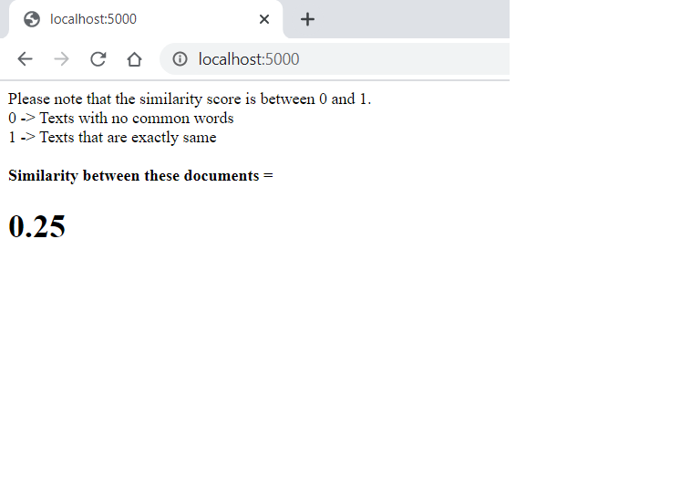
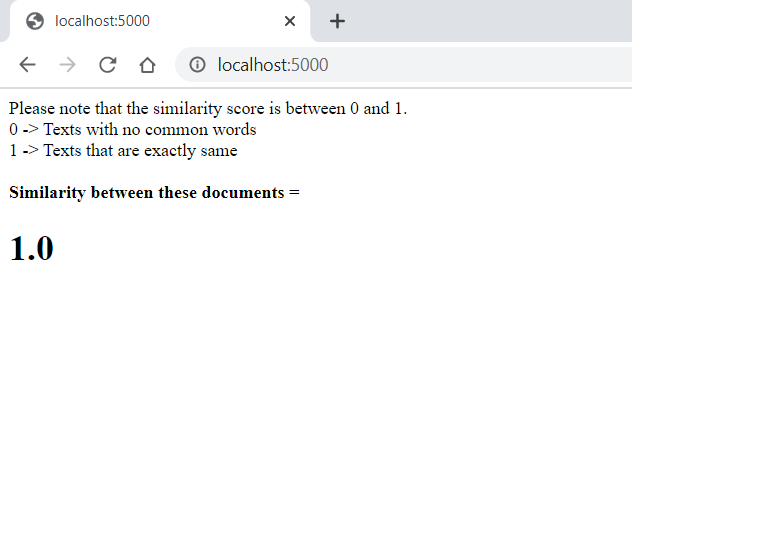
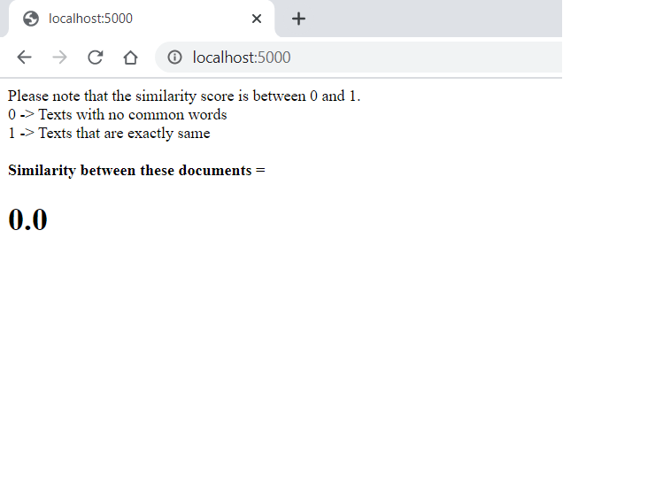
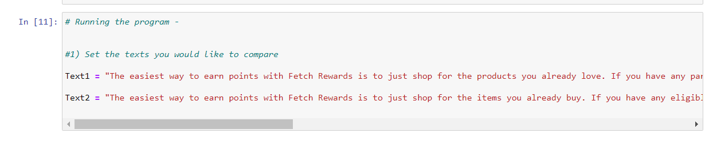
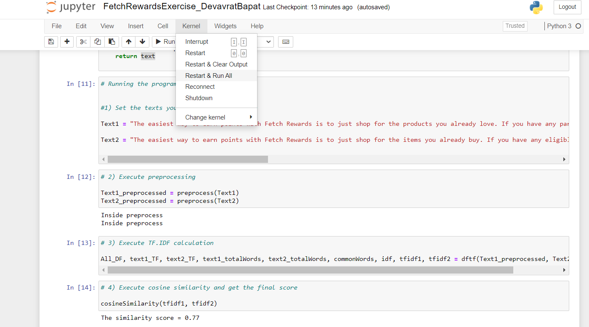

# Fetch Rewards Exercise

Job position - <b> Data Engineer </b><br>
Applicant - <b> Devavrat Bapat </b>
Email id - <b> bapat.dev@gmail.com </b>
<br>
Test requirements - <a>https://fetch-hiring.s3.amazonaws.com/data-engineer/text-similarity.html</a>
<br>
## How to run the code ?
<br>
1] Pull this image from the repository - <b>devavrat714/fetchrewards-devavratbapat:1</b> <br>
Please use the tag name :1<br>
<br>
2] Use the below command to run the image

``` sh
docker run -it --name db -p 5000:5000 devavrat714/fetchrewards-devavratbapat:1
```

3] Alternatively you can also do the same using Docker desktop -
Click RUN once the image has been pulled.



4] Go to Container/Apps and click "OPEN IN BROWSER"



5] Alternatively you can also open browser and go to this URL
<b>http://localhost:5000/</b><br>



6] Enter text in Text1 and Text2.<br>
Please do not leave Text1 and/or Text2 blank. This will result in a score of 0.<br>

7] Please click the below link for to see the Docker repo
https://hub.docker.com/repository/docker/devavrat714/fetchrewards-devavratbapat

## How to run ?

As explained in the test description -

1] When Sample 1 is compare to Sample 2 we get the following result




2] When Sample 1 is compare to Sample 3 we get the following result




3] When Same text is entered in both the fields



4] When completely different texts are entered in both fields



Please note that the scores range from 0 and 1.
0 -> If either or both texts are empty. Or they do not have any common words.
1 -> If the texts are exactly same or extremely similar.

I am attaching Jupyter notebook if the docker version does not run for some reason.

To run the code in Jupyter notebook - 
Go to the very bottom of the code and change the text to your choice like below.



Once you enter the text you want to compare, click Kernel and then Restart & Run All



